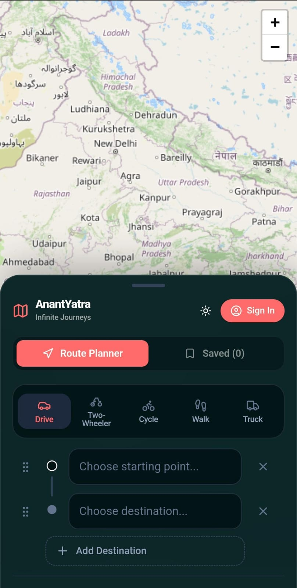

# AnantYatra — Infinite Journey Planner

[](https://anantyatra.codesagepath.dev/)
[](https://github.com/CodeSagePath/AnantYatra/releases)
[](https://opensource.org/licenses/MIT)
[](https://nodejs.org/)
[](https://react.dev/)

AnantYatra (Infinite Journeys) is a full-stack, map-first route planning platform designed for calculating complex multi-stop road trips without artificial waypoint limits. It combines a responsive floating interface with a self-hosted C++ Valhalla routing engine for high-performance navigation across multiple vehicle transport modes.

Live Application: https://anantyatra.codesagepath.dev/

---

## Interface Preview



---

## Core Capabilities

- **Unlimited Waypoint Planning**: Construct itineraries with any number of stops, bypassing the artificial location limits common in public routing APIs.
- **Drag-and-Drop Itinerary Management**: Reorder stops dynamically on the fly using interactive drag-and-drop handles powered by `@dnd-kit`.
- **Google Maps-Style Transport Selector**: Switch vehicle profiles to recalculate real-time routes instantly:
  - **Drive** (`auto`): Optimized for automobile highway and standard road networks.
  - **Two-Wheeler** (`motorcycle`): Tailored for motorcycles and scooters.
  - **Cycle** (`bicycle`): Uses designated bike paths and lower-speed secondary roads.
  - **Walk** (`pedestrian`): Direct pedestrian paths, footbridges, and walking routes.
  - **Truck** (`truck`): Routing tailored for commercial heavy-duty transport.
- **Geocoding & Location Search**: Instant place lookup using OpenStreetMap Nominatim with local search history caching.
- **Mobile-Optimized Interface**: Responsive bottom sheet drawer, touch-friendly interactive targets, and unobscured map controls for handheld devices.
- **Theme Support**: Includes dark and light UI themes with customized HSL color palettes and glassmorphism styling.
- **Itinerary Persistence**: Save and retrieve custom routes securely with JWT-based authentication.

---

## Architecture & Tech Stack

### Frontend
- **Framework**: React 19, TypeScript, Vite
- **Mapping & Visuals**: React-Leaflet, OpenStreetMap tiles
- **Styling & UI**: Tailwind CSS, Lucide Icons, Custom HSL Design Tokens
- **State Management**: Zustand (Auth, Theme, Route State)
- **Interactivity**: `@dnd-kit` for drag-and-drop waypoint sorting

### Backend API
- **Runtime & Server**: Node.js with Express
- **Database & ORM**: SQLite managed via Prisma ORM
- **Security & Auth**: JSON Web Tokens (JWT) with Bcrypt password hashing

### Routing Infrastructure
- **Engine**: Containerized Valhalla C++ routing engine running via Docker
- **Automation**: Custom shell scripts for zero-downtime container management and limit patching

---

## Quick Start Guide

### Prerequisites
Before running the application locally, ensure your machine has:
- Node.js (version 18 or higher)
- npm (version 9 or higher)
- Docker (required for the Valhalla C++ routing service)
- Git

---

### Step 1: Clone the Repository
Clone the codebase to your local machine:
```bash
git clone https://github.com/CodeSagePath/AnantYatra.git
cd AnantYatra
```

To check out a specific release version (for example, v1.0.0):
```bash
git clone --branch v1.0.0 https://github.com/CodeSagePath/AnantYatra.git
cd AnantYatra
```

---

### Step 2: Start the Valhalla Routing Engine
AnantYatra uses a containerized Valhalla routing engine. Run the interactive Docker manager script:
```bash
./docker-valhalla.sh
```
Select option 1 to start the Valhalla container on port 5005.

---

### Step 3: Configure and Start the Backend Server
Navigate to the server directory, install dependencies, configure environment variables, and initialize the database:

```bash
cd server
npm install
cp .env.example .env
npx prisma db push
npm run dev
```
The backend API server will listen on `http://localhost:5005`.

---

### Step 4: Configure and Start the Frontend Client
In a new terminal window, navigate to the client directory, install dependencies, and launch Vite:

```bash
cd client
npm install
cp .env.example .env
npm run dev
```
Open `http://localhost:5173` in your browser to access the application.

---

## Environment Configuration

### Backend Server (`server/.env`)
```env
PORT=5005
DATABASE_URL="file:./dev.db"
JWT_SECRET="your_secure_jwt_secret"
ROUTING_HOST="http://localhost:5005"
```

### Frontend Client (`client/.env`)
```env
VITE_API_URL="http://localhost:5005"
```

---

## Production Deployment Automation

For Linux VPS deployments (using PM2 and Nginx), helper scripts are provided in the project root:

- **Deploy Backend Updates**:
  ```bash
  ./backend-update.sh
  ```
- **Deploy Frontend Updates**:
  ```bash
  ./frontend-update.sh
  ```
- **Manage Docker Routing Container**:
  ```bash
  ./docker-valhalla.sh
  ```

---

## Contributing

Contributions are welcome. If you would like to report a bug or propose a feature:
1. Fork the repository.
2. Create your feature branch (`git checkout -b feature/new-feature`).
3. Commit your changes (`git commit -m 'Add new feature'`).
4. Push to the branch (`git push origin feature/new-feature`).
5. Open a Pull Request with a clear description of your changes.

---

## License

This project is licensed under the MIT License. See the `LICENSE` file for details.
